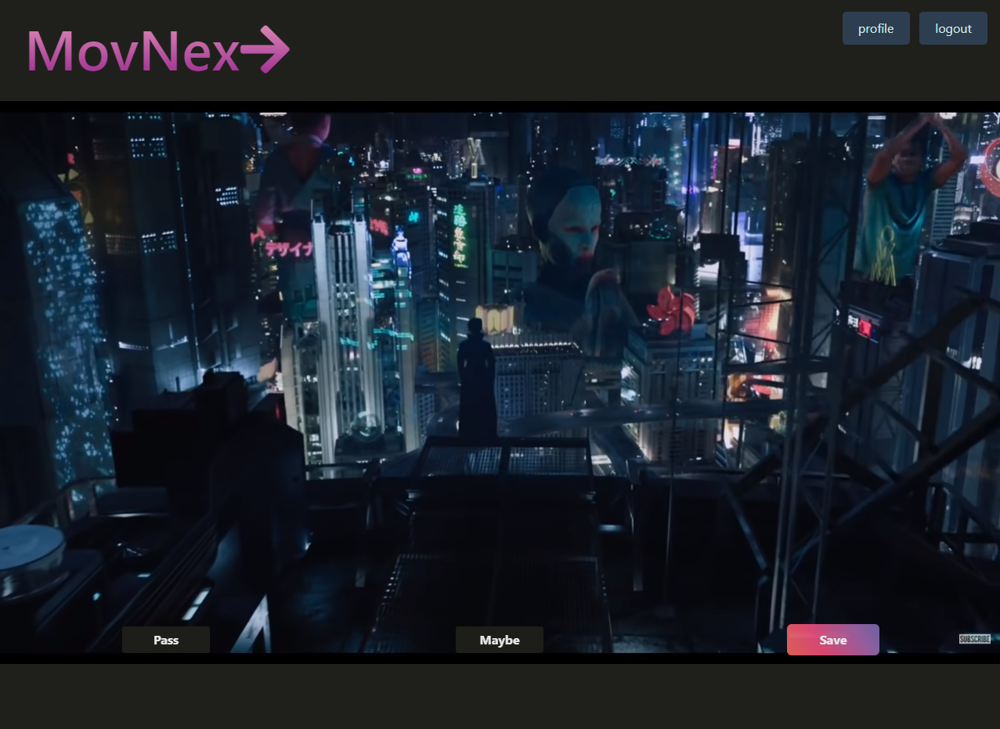
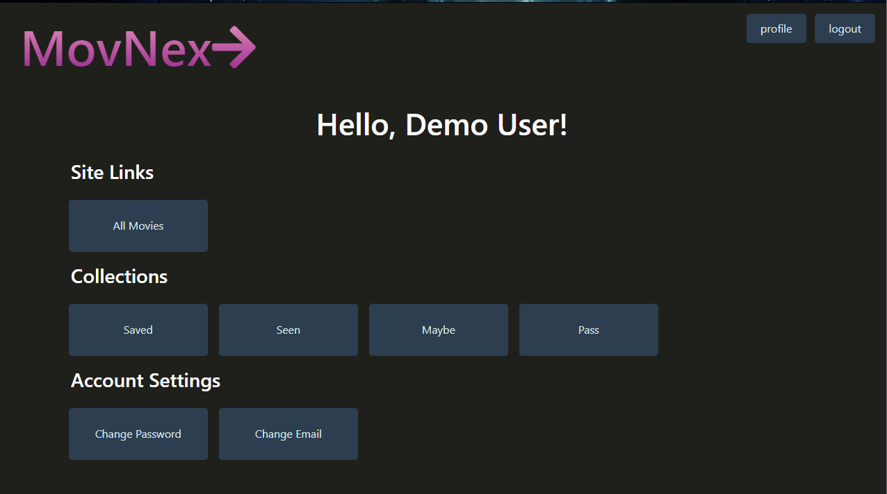
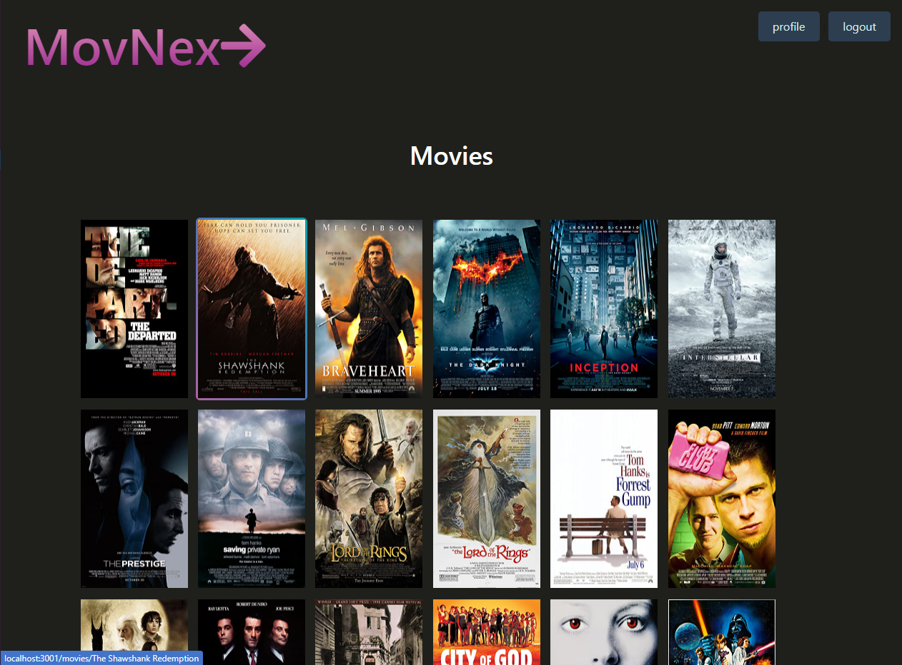

# MovNex➩

## General 📖
---    
- Github:    https://github.com/Kyle7286/MoveNex/
- Deployed Site: https://tranquil-escarpment-78206.herokuapp.com/
- Presentation: https://docs.google.com/presentation/d/1IepNyhmSaX_KIuRZqsNU3MtxDt1G_K1sU6SXPgCgoCU/edit?usp=sharing
- Video: https://drive.google.com/file/d/1BpSXLmsFKTblF-t5UjfO4xc7K0Y8zVsf/view?usp=sharing

- Rockstar Collaborators: 
     [Brandon Haley](https://github.com/kyle7286) 
     [Juan Echeverry](https://github.com/jpecheverryp) 
    [ Devante Johns ](https://github.com//Devante-Andrew-Johns21) 
    [ Jordan Mitchell ](https://github.com/JMitchell95)

## About/Purpose ❔
---
MovNex➩ is a web application which was designed for the avid movie enthusist in which will help you decide on your next movie to watch  when you are out of ideas and looking to discover something new or rediscover something old. MovNex allows users to signup for a free account which immediately provides you a constant feed of trailers for which you watch and decide to mark them as `saved`, `pass`, `maybe` and `seen`.  Users can see their `collection` of movies for each category listed earlier and make edits or mark them as `seen`.  Overtime, this will help MovNex➩ more accurately show you trailers that you might be interested in.

## How to Use
---
1. Navigate to website
2. Signup / Login
3. Watch Trailer
4. Click the button to flag a movie into a collection
5. Go to Profile
6. Click on the appropriate links to view the selections you have made
7. Click on a movie poster to view more details
8. Click on a poster button to mark the movie as seen, pass or maybe
9. Enjoy!

## Technology Used
---
* mySQL
* Sequelize.js
* Boostrap 5
* Underscore.js
* Express.js
* Node.js
* Session.js
* Handlebars.js
* JQuery
    

## Screenshot(s) 📊
---

## Thank you 👍 
---
Thank you for your time checking out our website! It means a lot to us :)